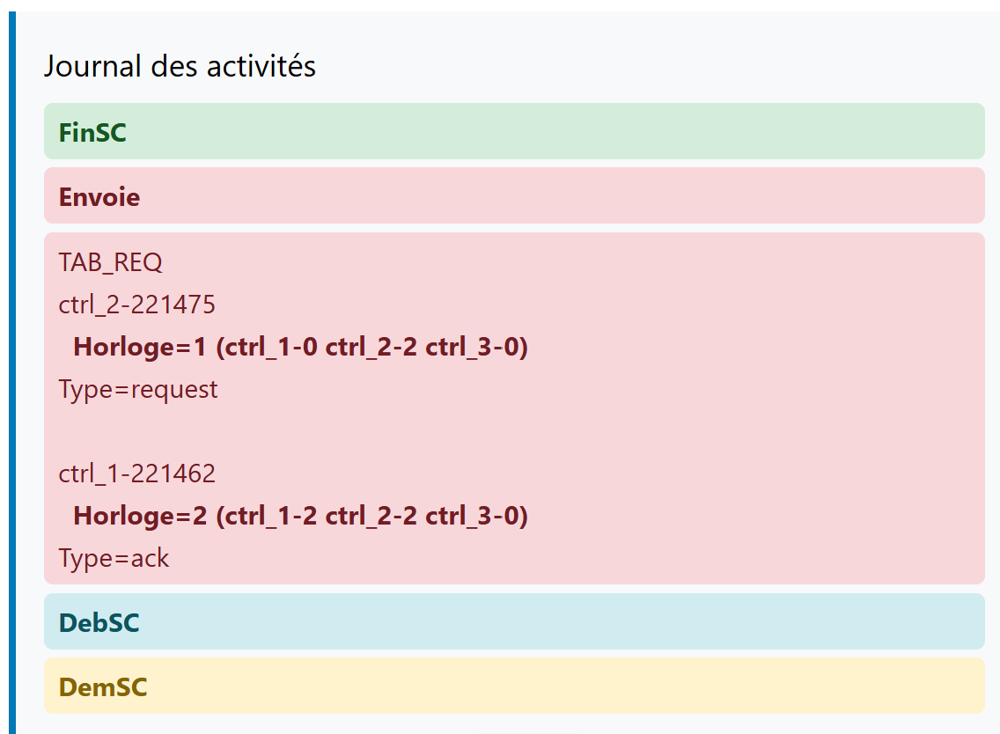
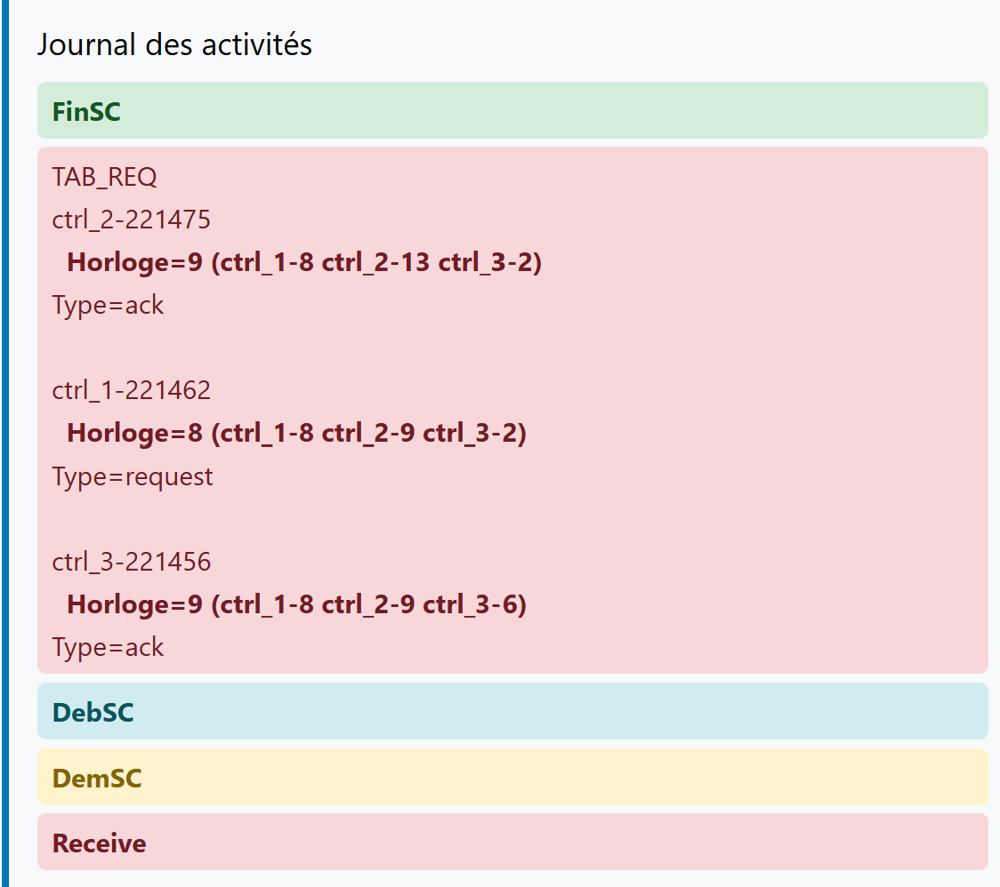

# Projet SR05 - programmation d'une application répartie

## Prérequis

On utilise le stack technique :
- Back-end : golang 1.23
- Front-ed : vue.js
- Com : websocket (gozilla)
- une architecture linux

Pour lancer l'app, ouvrir un terminal et faire
```bash
./run.sh
```
Pour accéder à l'interface graphique de chaque site, faire ctrl+clic sur les trois liens http:
- http://localhost:5173/
- http://localhost:5174/
- http://localhost:5175/


## I) Scénario

Post effondrement, une épidémie se propage et touche les hôpitaux d'une région. Les médecins s'affairent d'un hôpital à l'autre pour soigner les malades. Un hôpital peut envoyer un médecin à un autre hôpital.

Donnée partagée entre les sites : **nombre de médecins par hôpital.**

Fonctionnalités principales:
- fonctionnalités de base : construction du réseau et connexion avec le front
- cohérence des réplicats grâce à l’algorithme de file d’attente répartie
- sauvegarde répartie datée grâce à l’algorithme de calcul d’instantanés

## II) Architecture du réseau

**Topologie**. Le réseau est un anneau unidirectionnel entre trois applications de contrôle (ctrl) combiné à un lien bi-directionnel entre chaque application de contrôle et son application de base (app). Un site est le sous-réseau d'une app et de son ctrl. Si un site envoie un message sur l’anneau, il peut potentielement atteindre tous les sites. Les communications sont FIFO (first in, first out), les messages ne se dépassent donc pas.

### Construction du réseau

On construit le réseau avec le shell: les commandes sont automatisées grâce à un shell script `run.sh`

```bash
#Création des entrées et des sorties de chaque application. 
mkfifo /tmp/in_A1 /tmp/out_A1 /tmp/in_C1 /tmp/out_C1
mkfifo /tmp/in_A2 /tmp/out_A2 /tmp/in_C2 /tmp/out_C2
mkfifo /tmp/in_A3 /tmp/out_A3 /tmp/in_C3 /tmp/out_C3

#Lancement de chaque application et stockage des PIDs
go run app/*.go -n "app_1"  < /tmp/in_A1 > /tmp/out_A1 & pids+=($!)
go run ctrl/*.go -n "ctrl_1" < /tmp/in_C1 > /tmp/out_C1 & pids+=($!)

go run app/*.go -n "app_2"  < /tmp/in_A2 > /tmp/out_A2 & pids+=($!)
go run ctrl/*.go -n "ctrl_2" < /tmp/in_C2 > /tmp/out_C2 & pids+=($!)

go run app/*.go -n "app_3"  < /tmp/in_A3 > /tmp/out_A3 & pids+=($!)
go run ctrl/*.go -n "ctrl_3" < /tmp/in_C3 > /tmp/out_C3 & pids+=($!)

#Connexions des flux avec les tubes (|), les tubes nommés et la commande tee
cat /tmp/out_A1 > /tmp/in_C1 & pids+=($!)
cat /tmp/out_C1 | tee /tmp/in_A1 > /tmp/in_C2 & pids+=($!)

cat /tmp/out_A2 > /tmp/in_C2 & pids+=($!)
cat /tmp/out_C2 | tee /tmp/in_A2 > /tmp/in_C3 & pids+=($!)

cat /tmp/out_A3 > /tmp/in_C3 & pids+=($!)
cat /tmp/out_C3 | tee /tmp/in_A3 > /tmp/in_C1 & pids+=($!)
```

### Interface graphique 
On ajoute une interface graphique (client web) pour contrôler l'activité de chaque app (serveur). Notre application étant en temps réel, elle crée une websocket, associée à un port particulier (ex : 8080), pour transférer de petites quantités d'informations du serveur vers le client et **réciproquement**. Trois utilisateurs peuvent ainsi se connecter et participer à l'application via leur navigateur.


### Algorithme de contrôle

On utilise l'algorithme de contrôle pour distinguer les fonctionnalités applicatives des fonctionnalités de contrôle.
Un contrôleur intercalé entre chaque application et l'anneau permet de contrôler l'activité entre l'app et le réseau. Le ctrl intercepte les messages envoyés et reçus et leur applique un **traitement**, comme par exemple en marquant le message d'une couleur (un site blanc devient rouge).
> **Algorithme de contrôle**
- quand ctrl reçoit un message en provenance de son app `(m)`, il y ajoute des infos de controle `(m, marqueur,...)` avant de le transmettre sur l'anneau
- quand ctrl intercepte un message à destination de son app de la forme `(m, marqueur...)`, il utilise les infos de contrôle pour mettre à jour les siennes, puis transmet le message  sans le traitement `(m)` à son app

Dans le cas d'un réseau non FIFO, cet ajout d'un contrôleur permettrait de s'assurer que le **message** `(m)` n'arrive pas avant le **marqueur** `(marqueur,...)`. On éviterait ainsi de mettre à mal le processus de diffusion.


## III) Cohérence des réplicats

Chaque site connaît le nombre de médecins présents sur les autres sites, c'est notre donnée partagée. Pour assurer la cohérence des réplicats, on utilise un algorithme qui permet à chaque site de gérer son entrée en section critique (SC):
> **Algorithme de file d'attente répartie**
- Quand un site souhaite envoyer un médecin à un autre site, il doit d'abord *demander* et *obtenir* la section critique. Il la *relache* une fois la donnée partagée *mise à jour* (nombre de médecins local décrémenté).
- de même, pour recevoir un médecin, un site doit demander et obtenir la section critique. Il la relache une fois la donnée mise à jour (nombre de médecins local incrémenté).


### Estampilles

Pour la cohérence des réplicats, on utilise les estampilles. Les estampilles K permettent en effet de construire une horloge injective : à chaque action correspond une date unique (H(a_i),i). Les actions peuvent alors être strictement et totalement ordonnées dans une liste; on obtient ainsi une unique observation (ou file d’attente).

Au cours de l'algorithme, chaque site reçoit tous les messages REQ et LIB de tous les autres sites et construit sa propre file d’attente FIFO grâce aux estampilles. Chaque site prend une décision au regard de sa file d’attente (exclusion mutuelle) : si la requête du site est de type REQ et qu’il a l’estampille la plus ancienne, alors il entre en SC.


### Déroulement de l'algorithme

Depuis l'interface de app_i, un utilisateur clique sur "envoyer un médecin" vers le site app_j. Le front envoie alors un message à travers la websocket à son back app_i <ins>(début)</ins>: 
- App envoie un message `(demSC)` au ctrl et attend
- Ctrl envoie un message de type `(req, horloge locale, sender)` sur l'anneau
- quand le ctrl a reçu un message de type `(req ou ack, h, sender)` de chaque site et qu'il a la plus petite estampille, il informe son app qu'elle a la SC `(debSC)`
- App décrémente `medecin-=1` la donnée puis envoie un message à son ctrl : `(finSC, réplicat)`
- Ctrl_i transmet un message de type `(réplicat, lib, h, sender)` 
- les ctrl_j reçoivent un message de type `(réplicat, lib, h, sender)`: ils mettent à jour leur horloge et transmettent le réplicat à leur app.
- App_i envoie à son controleur `(médecin) à S_j`
- Ctrl_i transmet le `(médecin) à S_j` sur l'anneau





Si le site n'est pas le destinataire du message `(médecin)`, il le transmet sur le réseau.
Sinon si le site est le destinataire du message, il le traite: 
- Ctrl informe son App de la réception d'un médecin
- l'App demande la section critique à son ctrl et attend `waitingforreceiving()`
- Ctrl envoie un message de type `(req, horloge locale, sender)` sur l'anneau
- quand le ctrl a reçu un message de type `(ack ou req, h, sender)` de chaque site et qu'il a la plus petite estampilel, il informe son app qu'elle a la SC `(debSC)`
- App incrémente la donnée `medecin+=1` puis envoie un message à son ctrl : `(finSC, réplicat)`
- Ctrl transmet un message de type `(réplicat, lib, h, sender)` sur l'anneau
- tous les autres sites mettent à jour leur (réplicat) et leur estampille.




## IV) Sauvegarde répartie datée

 La **sauvegarde** consiste à réunir des photos locales de l'état de chaque site. Chaque site capture ainsi son état lors du clic et l’envoi sur le réseau à l'état initiateur de la sauvegarde. 

Le **problème réparti** rencontré est le suivant : les clics n’ont pas lieu en même temps car les sites ne sont pas synchronisés. Comment faire pour construire un état global cohérent? 

> **Algorithme de lestage avec collecte des états locaux**

Cet algorithme permet de diffuser la sauvegarde à partir d'un site initiateur sur tout le réseau et de collecter tous les états locaux capturés sur ce même site initiateur pour contruire alors un état global cohérent. En raison de la complexité de l'algorithme, on décide d'en expliquer la construction par ajout de fonctionnalités.


### Déroulement de notre algo 

- Un utilisateur clique sur **« Déclencher une sauvegarde instantanée »**.
- Un message `"snapshot"` est transmis du **front** au **back App** via la WebSocket.
- Ce message `"snapshot"` est ensuite retransmis de **App** à **Ctrl**.
- Le **Ctrl** démarre la sauvegarde :
    - il passe en **couleur rouge**,
    - définit `initiateur = true`,
    - et envoie l'information de sauvegarde aux autres sites.
- Lorsqu’un site reçoit un message indiquant le début de la sauvegarde :
    - il demande à son **App** de lui transmettre son état local,
    - l’**App** envoie alors son état local au **Ctrl**,
    - le **Ctrl** transmet cet `étatLocal` sur l’**anneau**.
- Lorsque le site **initiateur** reçoit l’`étatLocal` d’un site `S_j` :
    - il l’ajoute à l’**état global**,
    - décrémente le **nombre de sites attendus**,
    - si ce nombre atteint zéro :
        - il sait que la sauvegarde est terminée,
        - il envoie l’**état global** à son **App**,
        - et l’**App** le transmet au **front** via la WebSocket.

_______________

### Algorithme de lestage
1. <ins>(Initialisation)</ins> : Les variables de chaque site sont initialisées, en particulier `couleur <- blanc` 

2. Une app reçoit un message de son front lui indiquant de lancer la sauvegarde <ins>(début)</ins>. L'app envoie alors un message `(save)`à son ctrl qui le réceptionne <ins>(réception)</ins>. 

3. Le ctrl met à jour sa couleur <ins>(début)</ins>

4.  Le ctrl applique un traitement au message: il est lesté d'une couleur `(save, rouge)` en vue de diffuser la sauvegarde. Le ctrl le transmettre sur l’anneau <ins>(émission)</ins>.

2. Le premier ctrl de l’anneau intercepte le message <ins>(réception)</ins>, compare sa couleur à celle du message. Comme les couleurs diffèrent : `couleur<-rouge`. Ainsi, lorsqu'un site est prévenu de la sauvegarde, sa couleur passe de Blanc à Rouge. Le ctrl envoie ensuite le message sans marqueur à son app `(save)` et fait circuler sur l'anneau le message `(save, rouge)` pour diffuser la sauvegarde aux sites suivants <ins>(émission)</ins>.

3. le même processus se déroule sur les autres sites jusqu'à ce que le message revienne à l'initiateur, déjà rouge. [FIN]

--------------

### Algorithme de collecte des états locaux
*On ajoute la collecte des états locaux à l'algorithme de lestage, décrit ci-dessus.*

Hypothèse : on suppose que le site initiateur connaît le nombre de site sur l'anneau, ici 3.

1. <ins>(Initialisation)</ins>. Les variables de chaque site sont initialisées : `initiateur <- false`, EG l'état global `EG_i<- {}` et le nombre d'états attendus `NbEA_i <- 3` 

2. Une app reçoit un message de son front lui indiquant de lancer la sauvegarde <ins>(début)</ins>. L'app envoie alors un message `(save)` <ins>(émission)</ins> à son ctrl qui le réceptionne <ins>(réception)</ins>. 

3. Le ctrl à l'initiative de la sauvegarde met à jour ses variables <ins>(début)</ins>. `initiateur <- True`, EG l'état global `EG_i<- {etatLocal_i}` et le nombre d'états attendus `NbEA_i <- 2` . L'état local contient le nom du site, son horloge vectorielle, ainsi que son nombre de médecins.

4. Le ctrl applique un traitement au message : le message est lesté d'une couleur `(save, rouge)` en vue de diffuser la sauvegarde. Le ctrl le transmettre sur l’anneau <ins>(émission)</ins>.

5. Le premier ctrl de l’anneau intercepte le message <ins>(réception)</ins>, compare sa couleur à celle du message. Comme il est blanc, il met à jour ses variables, dont `EG_i<- {etatLocal_i}` et envoie un message `(état, EG_i)`sur l'anneau à destination du site initiateur <ins>(émission)</ins>. Les autres ctrl font de même.

6. <ins>(réception)</ins>. Le ititiateur réceptionne les uns après les autres les messages `(état, EG_j)`: il ajoute `EG_j`à son ensemble pour former petit à petit l'état global et décrémente `NbEA` jusqu'à que la variable atteigne 0. Tous les états locaux ont alors été reçus. [FIN]


### Gestion des messages prépost

*On ajoute la collecte des messages prépost à l'algorithme de collecte des états locaux, décrit ci-dessus.*


Un message prépost est un message envoyé sur l’anneau par un site S_i après que la sauvegarde a été initiée sur un site mais avant que le site S_i ait été prévenu du lancement de la sauvegarde. Ce message en transit sur le canal n’est donc compris dans aucune capture d’état local, il est de couleur blanche. On complète donc l’algorithme pour que ce message soit identifié comme prépost par le premier site rouge sur lequel il arrive : `si je suis rouge et que je reçois un message blanc => prépost`.

Une fois le message prépost identifié et marqué `message.prepost<-true`, le site rouge le renvoie sur l’anneau. Chaque site le transfère jusqu'à ce que l'initiateur de la sauvegarde l’intercepte `si initiateur == True` et l’ajoute à l'état global de la sauvegarde : `EG_i<- EG_i U {prepost}`

Comme les communications sont FIFO sur l'anneau logique (aucun message ne peut en dépasser un autre), il n'est pas nécessaire de vérifier que tous les messages préposts sont arrivés : un message prépost envoyé par un site (alors encore blanc) le sera toujours avant l'envoi du message état de ce site (devenu rouge). Quand la variable permettant au site initiateur de compter les messages états reçus `NbEA_i` arrive à 0, tous les messages prépost ont déjà été reçus et ajouté à l'état global. 

A la fin de l’algo, le site initiateur de la sauvegarde a construit un état global du système `EG_i` qui contient :
- les états locaux des trois sites du réseau
- tous les messages préposts


Si le réseau n'était pas FIFO, on aurait du ajouter une variable `bilan` sur chaque site pour évaluer de façon répartie le nombre de messages prépost/en transit : `bilan_i = somme émis(i->j) - somme reçu(i<-j)`. Chaque site enverrait ensuite un message `(bilan)` au site initiateur qui complèterait petit à petit la carte des messages attendus `NbMA_i <-NbMA_i + bilan`. L'algorithme terminerait alors quand `NbMA_i == 0`.

Une fois la sauvegarde terminée, on aurait pu vérifier grâce aux horloges vectorielles la cohérence de la sauvegarde.